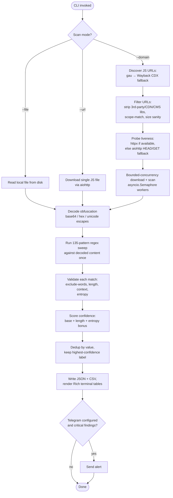
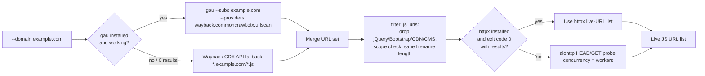
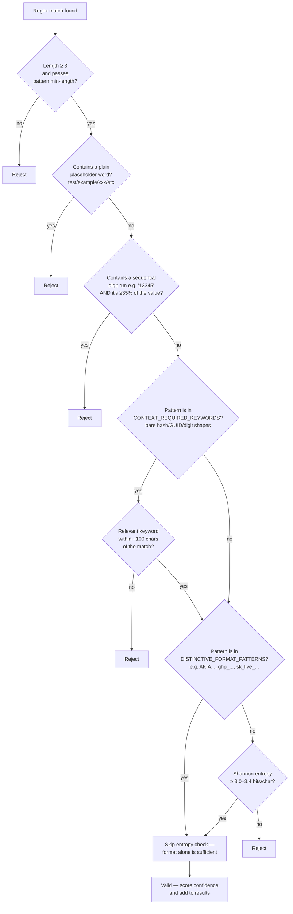
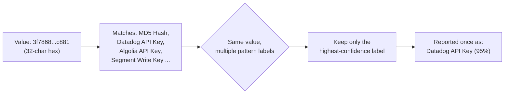

# Architecture & Workflow

Diagrams below use [Mermaid](https://mermaid.js.org/), which GitHub renders natively in
`.md` files — no extra tooling needed to view them.

## 1. High-Level Scan Workflow



## 2. Domain Discovery Detail



**Fixed in this version:** step G previously only fell back on a *crashed*
httpx process (missing binary, timeout). If httpx ran but exited non-zero — common
across CLI versions as flags changed — the old code returned an **empty list with no
fallback at all**, which is the most likely explanation for `--domain` silently
finding nothing. Now any non-zero exit or zero parsed results routes to the aiohttp
fallback instead.

## 3. Concurrency Model (`--workers`)

```mermaid
sequenceDiagram
    participant Main as scan_domain()
    participant Sem as asyncio.Semaphore(workers)
    participant W1 as Worker task 1
    participant W2 as Worker task 2
    participant WN as Worker task N

    Main->>Sem: create semaphore(workers)
    Main->>W1: schedule _scan_one_domain_file(url_1)
    Main->>W2: schedule _scan_one_domain_file(url_2)
    Main->>WN: schedule _scan_one_domain_file(url_n)

    W1->>Sem: acquire
    W2->>Sem: acquire
    Note over W1,W2: up to `workers` run concurrently;<br/>rest queue on the semaphore
    W1->>W1: aiohttp download → decode → regex match
    W1->>Sem: release
    W2->>W2: aiohttp download → decode → regex match
    W2->>Sem: release
    WN->>Sem: acquire (once a slot frees)
    WN->>WN: aiohttp download → decode → regex match
    WN->>Sem: release

    Note over Main: asyncio.as_completed() collects<br/>results as each task finishes
```

**Fixed in this version:** `self.workers` was previously assigned in `__init__` and
never read anywhere else — `scan_domain()` ran a plain sequential `for` loop with a
blocking `subprocess.run(wget, ...)` call per file. `--workers 10` and `--workers 50`
produced identical (fully serial) runtime. This version bounds real concurrent
downloads with `asyncio.Semaphore(self.workers)`, so the flag now does what it always
claimed to do.

## 4. Secret Validation Decision Tree (`is_valid_secret`)



This is the core change from the original implementation, where only 6 hardcoded
keywords (`aws`, `google`, `github`, `jwt`, `stripe`, `oauth`) got any entropy
filtering at all, and no pattern had a context-keyword requirement — meaning bare
`[0-9]{12}` or `[a-f0-9]{32}`-style patterns fired on essentially any matching
substring in a file.

## 5. Confidence Consolidation



Several patterns share an identical character-class shape under different service
names (a bare 32-char hex string matches `MD5 Hash`, `Datadog API Key`, `Algolia API
Key`, and `Segment Write Key` simultaneously). Reporting all of them made one
ambiguous value look like 4-8 separate secrets. Findings are now consolidated to the
single highest-confidence interpretation per distinct value.

## 6. Known Limitations (documented honestly, not hidden)

- **Context-window bleed**: the ~100-char context check can occasionally pick up
  keywords from adjacent, unrelated code if a secret-sounding word happens to sit
  within the window. This is rare in real minified bundles (which have no comments
  and dense unrelated code between assignments) but can produce a false positive on
  hand-written or lightly-minified code with descriptive variable names nearby.
- **No live credential verification** — confidence reflects "looks like a real
  secret by shape/entropy/context," not "confirmed still active." Treat Critical/High
  findings as leads to manually verify, not confirmed impact.
- **Pattern count is 135**, not "300+" as stated in earlier marketing material for
  this tool — see `patterns.json` for the authoritative, versioned list.
